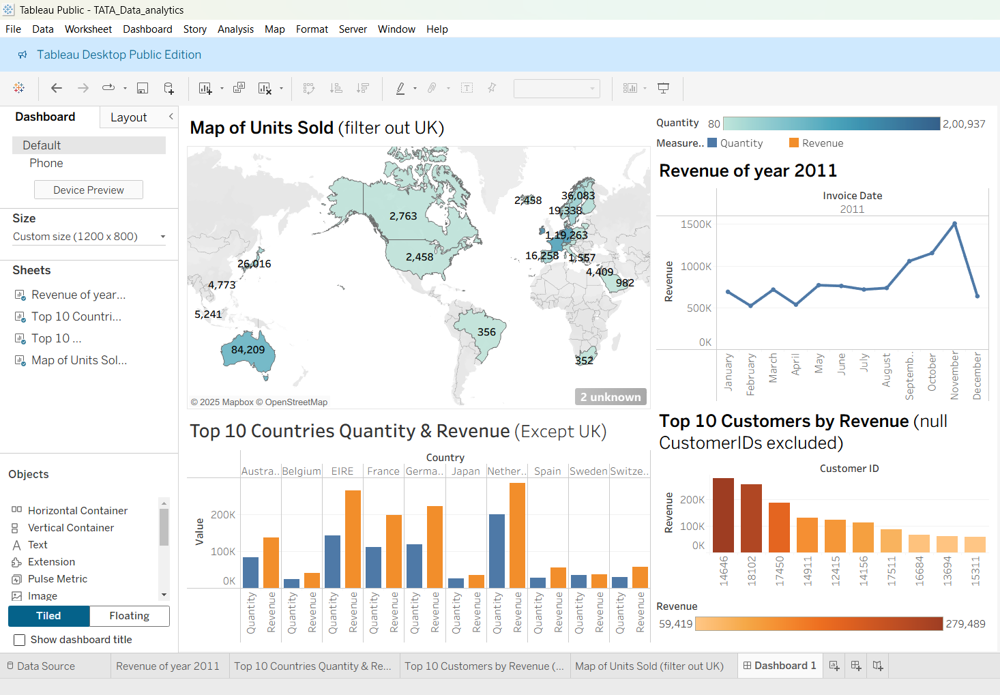
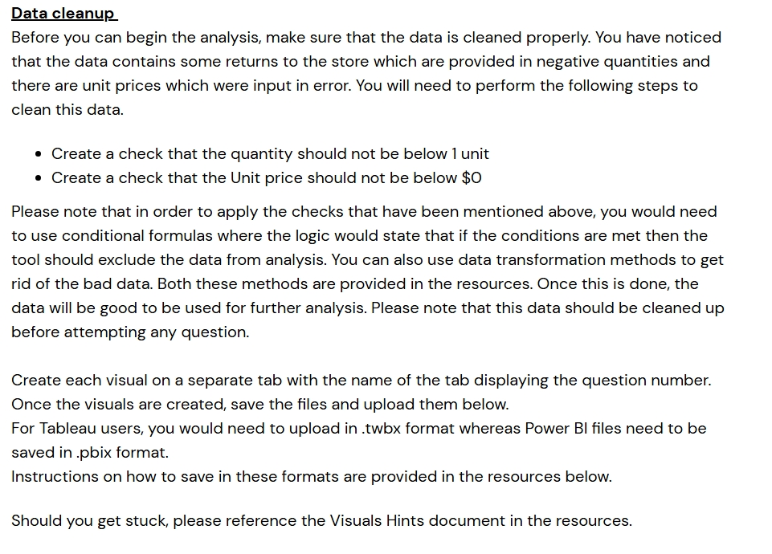
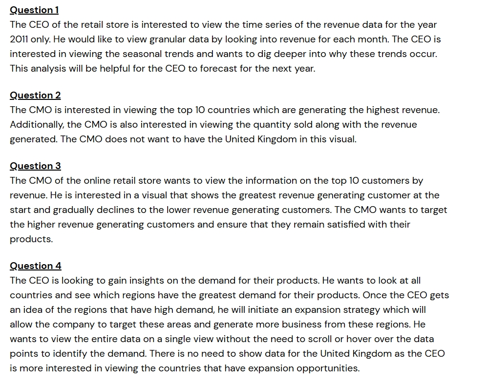

# 🌍 Global Sales Dashboard

  
  

An interactive Tableau dashboard offering a quick overview of global sales performance:

- 📌 Units sold by country  
- 🔄 Revenue vs. Quantity side-by-side comparison  
- 🏆 Top 10 customers based on total revenue  

This dashboard helps decision-makers quickly understand sales trends and regional performance at a glance.

---

## 🔗 Live Dashboard

👉 [**View on Tableau Public**](https://public.tableau.com/views/TATA_Data_analytics/Dashboard1?:language=en-US&publish=yes&:sid=&:redirect=auth&:display_count=n&:origin=viz_share_link)

---

## 🖼️ Dashboard Preview

  

---

## ⚙️ Challenges & Questions

    
  

---

## 📁 Repository Contents

| File Name                   | Description                              |
|----------------------------|------------------------------------------|
| `global_sales_dashboard.twbx` | Tableau packaged workbook file             |
| `preview.png`              | Static image of the final dashboard      |
| `challenge1.jpeg`          | Screenshot showing data cleaning efforts |
| `questions.jpeg`           | Visualization-oriented business questions|

---

## 👨‍💻 About Me

**Aditya Choudhary**  
💻 *MCA | Web Developer | Data Enthusiast | C++ Programmer*  
📬 **Email:** [caditya965@gmail.com](mailto:caditya965@gmail.com)  
🔗 **LinkedIn:** [adiityachoudhary](https://www.linkedin.com/in/adiityachoudhary/)  
🌐 **Portfolio:** [adiityachoudhary.github.io/portfolio/](https://adiityachoudhary.github.io/portfolio/)

---
